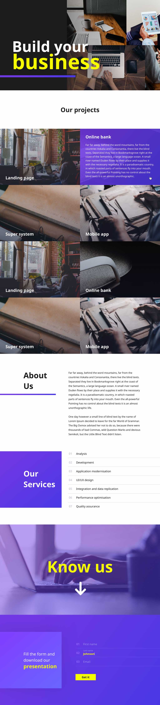

# Junior testinė užduotis

__Užduotis:__ sukurti puslapį pagal pateiktą dizainą:

[Nuoroda į dizainą](https://invis.io/BHFMMER8E7C)

### Dizaino paaiškinimai:

* Pradžioje, atsidarius puslapį, atsiranda viršutinės dalies nuotraukos, po to tekstas „Build your business“ ir iš kairės į dešinę nusibrėžia linija
* Nuotraukos, esančios viršutinėje dalyje, gali keistis kas kelias sekundes
* Hoverinant ant projekto, papildomai atiranda ir jo aprašymas
* "About us" - jei tekstas, esantis dešinėje, netelpa per aukštį į ekraną, "About us" antraštė turėtų būti prikibusi kairiam šone, o scrollintųsi tik pats tekstas;
* "Our services" – sąrašo elementai galėtų atsirasti ne vienu metu, o greitai išsirikiuoti vienas po kitu
* Gale esančioje formoje pradėjus rašyti labelis turėtų pasislinkti į viršų, kaip ir pavaizduota
* Puslapis turi būti pritaikytas ir mobiliems įrenginiams

### Techniniai reikalavimai:

* Nenaudoti jokių HTML bibliotekų kaip pvz.: Foundation, Bootstrap ir pan.
* Kodą paruošti produkcijai (suminifikuoti assetus) paliekant ir originalius failus (privalumas būtų jeigu tam būtų sukurti scriptai kurie tai atliks)
* Kodas turi būti semantinis
* Privalumas būtų naudoti vieną iš css preprocesorių pvz.: Sass, Less, Stylus
* Privalumas būtų nenaudoti javascript'o bibliotekų, o pateikti viską vanilla js
* Jeigu yra būtina paruošti instrukciją aplikacijos paleidimui

Šiai užduočiai skirti ne daugiau 4h ir padaryti kiek įmanoma daugiau.